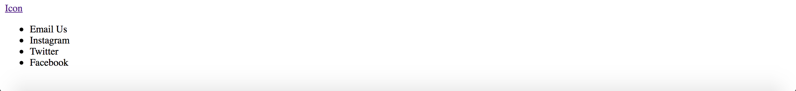
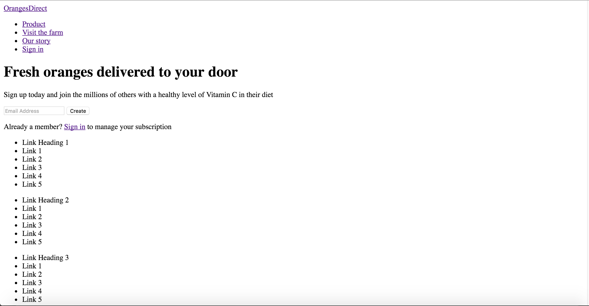

I created a landing page for an orange delivery service (OrangesDirect) with a simple sign-in box as Slack did. 

I used flex boxes for almost all of the CSS construction (including a column with everything in the page as a flex item, and then each flex item usually was another flex box with its own items).

I added a lot of interesting styling such as:
- Nav bar links that display a rounded-edge background, as in slack
- Email address field that displays a custom border (using outline: 0 and border: ...)
- Link headings that use text-transform: uppercase
- Gradient below the background picture to transition into the footer

In addition, I used a width of 790px to distinguish between desktop and mobile, since the nav bar didn't fit with widths less than 790px. I did not use 640px as was described in the HW1 instructions.

URL to GitHub repository: https://github.com/henryhwilson/landing_page

URL to hosted page: http://hw1.henrywilson.me

Screenshots of layout without CSS:

